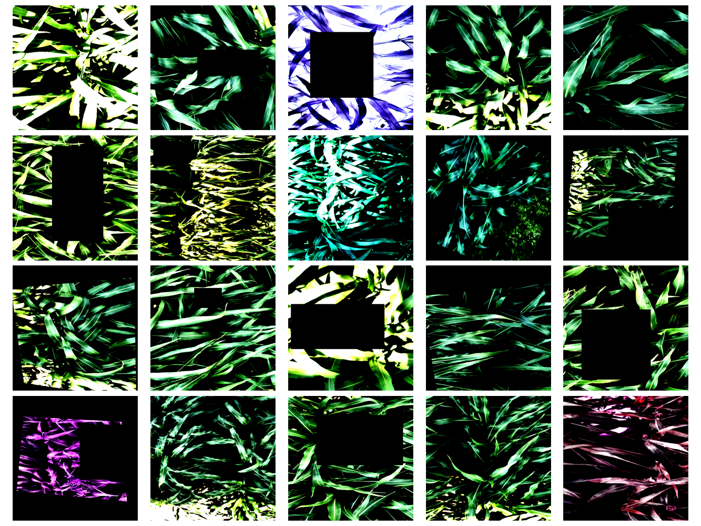

# Sorghum100-CultivarId
Code, Report and Presentation of my solution to the Sorghum -100 Cultivar Identification - FGVC 9 Kaggle Competition

# Before running

Must download data from https://www.kaggle.com/competitions/sorghum-id-fgvc-9/data
Put data in a folder named "data".
Create empty folders "embeddings", "models", "plots" and "Submissions" for the rest of the experiments.

# Explanation of all files and folders

Folders:
- Plots: stores the train and val accuracies of the experiments that were done
- models: stores the models ready to be loaded by pytorch
- figures: Are some figures we saved
- Embeddings: store the embeddings obtained by using the file create_embeddings.py
- Submissions: Here we store the csv submissions for the kaggle competition
- data: Here we store the competition data

Files:

- TrainModel.py: With this file we trained most of our models
- utils.py: some useful functions
- create_embeddings.py: How we create the embeddings
- CreateSubmissions.ipynb: Notebook to create submissions, in order we have the vanilla inference, the ensembling with averaging, and the ensembling with maxes (using the mode function).
- PlotMaker.ipynb: To do our plots
- WeightViz.ipynb: Extracting some weights
- SorghumDataset.py: Implementation of the class of our data.
- VisualizingDatasetTransforms.ipynb: See effects of transforms on data
